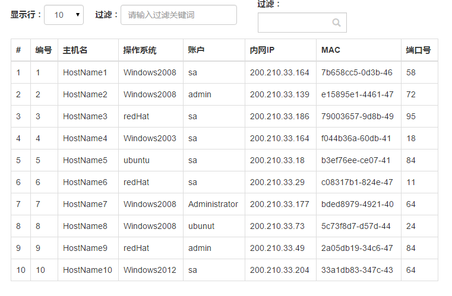

# react+redux 实例

## 技术列表

   | 名称 | 作用 |
   |------|----|
   | Webpack     | 即使编译工具  [webpack][4]|
   | Babel       | 用于es6转es5语法|
   | ECMAScript6 | 新版本的语法浏览器支持度不高。所以需要转换  [阮一峰 ECMAScript 6入门][2]|
   | Sass        | 选用 |
   | React       | 用于构建用户界面的JAVASCRIPT库  [react中文社区][3]|
   | Redux       | 基于Flux理论的状态管理库 [Redux 中文文档][5] |

   [2]: http://es6.ruanyifeng.com/
   [3]: http://www.reactjs.cn/react/docs/getting-started.html
   [4]: https://fakefish.github.io/react-webpack-cookbook/
   [5]: http://camsong.github.io/redux-in-chinese/index.html
    
## 运行实例
 1. 下载代码 `git clone https://github.com/fengzier/react-table.git`
 2. 安装依赖 `npm install`
 3. 运行项目 `npm start`
 4. 访问：[http://127.0.0.1:8080/webpack-dev-server/](http://127.0.0.1:8080/webpack-dev-server/)

## 项目结构分析
    react-table/           
    ├── components/         //react组件
    │   ├── R_Table.js       
    │   ├── R_Tbody.js
    │   └── R_Toobar.js
    ├── app/                // 组件入口            
    │   ├── app.js
    │   ├── app.scss
    │   └── common.js
    ├── redux/              //redux文件
    │    ├── actions.js
    │    ├── app.js
    │    └── reducers.js    
    ├── index.html
    ├── package.json
    ├── webpack.config.js    //webpack 配置文件

## 页面效果

## 代码分析

#### /webpack.config.js
    
    var webpack = require('webpack');
    module.exports = {
        entry: [
          'webpack/hot/only-dev-server',    //改变文件立刻刷新，而且保存了现有的state
          './app/app.js'                    //入口配置文件
        ],
        output: {
            path: './build',                
            filename: "bundle.js"           //输出文件，即index.html需要引入的文件。
        },
        module: {
            loaders: [
                { test: /\.js?$/, loaders: ['react-hot', 'babel'], exclude: /node_modules/ },
                { test: /\.js$/,  loader: 'babel-loader', exclude: /node_modules/},
                { test: /\.css$/, loader: "style!css" },
                { test: /\.scss$/, loader: 'style!css!sass'},
            ]
        },
        resolve:{
            extensions:['','.js','.json']
        },
        plugins: [
            new webpack.NoErrorsPlugin()
        ]
    };
 
 + $ webpack    // 编译文件
 + $ webpack -w // 提供watch方法，实时进行打包更新
 + $ webpack -p // 对打包后的文件进行压缩，提供production
 + $ webpack -d // 提供source map，方便调试。

#### index.html

    <!doctype html>
    <html lang="en">
        <head>
            <meta charset="utf-8">
            <title>React Table</title>
            <link rel="stylesheet" type="text/css" href="./node_modules/bootstrap/dist/css/bootstrap.css">
        </head>
        <body>
            

                

            
            
        
               //只引入打包好的文件。
        </body>
    </html>

在react的开发理念中，HTML只是作为一个站点的入口。

    
#### /app/app.js

    import './app.scss';                        //直接引入sass文件而不是css文件
    import React from 'react';
    import { render } from 'react-dom';
    import { createStore } from 'redux';
    import { Provider } from 'react-redux';
    import React_table_App from '../containers/App';
    import reactTableApp from '../containers/reducers';
    import common from './common';
    
    let store = createStore(reactTableApp);     // Redux 应用只有一个单一的 store
    let data = common.getData();                // 随机生成数据
    
    render(                                     //向页面输出组件
      <Provider store={store}>                  // store 只能使用privider传入
        <React_table_App data={data}/>
      </Provider>,
      document.getElementById('root')           //将组件渲染到#root dom中
    )
    
    store.subscribe(() =>     // 监听store的变化
        console.log("dispatch:",store.getState())
    );

#### ./containers/actions.js

    export const FILTER = 'FILTER';
    export const LENGHTMENU = 'LENGHTMENU';

    export function doFilter(text) {
      return { type: FILTER, text }
    }
    export function lengthMenu(text) {
      return { type: LENGHTMENU, text }
    }
定义actions

#### ./containers/reducers.js

     import { combineReducers } from 'redux';
     import { FILTER,LENGHTMENU } from './actions';     
     
     function operation(state = [],action){
        switch(action.type){
           case FILTER:
              return {FILTER:action.text};
           case LENGHTMENU:
              return {LENGHTMENU:action.text};
           default:
              return state;
        }
     }
     
     const reactTableApp = combineReducers({ //使用combineReducers 组合多个reducer
         operation,
     })
     export default reactTableApp;

#### ./containers/App.js

    import React, { Component, PropTypes } from 'react';
    import { connect } from 'react-redux';
    import { doFilter,lengthMenu } from './actions';
    import R_Table from '../components/R_Table';
    import R_Toobar from '../components/R_toobar';
    
    class App extends Component{
       render(){
          const {dispatch,operation} = this.props;     
          return(
             

                <R_Toobar            
                   onFilterChange={
                      (text)=>{
                         dispatch(doFilter(text));
                      }
                   }
                   onLengthMenuChange={
                      (text)=>{
                         dispatch(lengthMenu(text));
                      }
                   }
                   {...this.props}>
                </R_Toobar>

               <R_Table operation={operation} {...this.props}><    _Table>
            
               
         )
       }
    }
    function select(state){ 
       return {
          operation: state.operation
       };
    }
    export default connect(select)(App);

